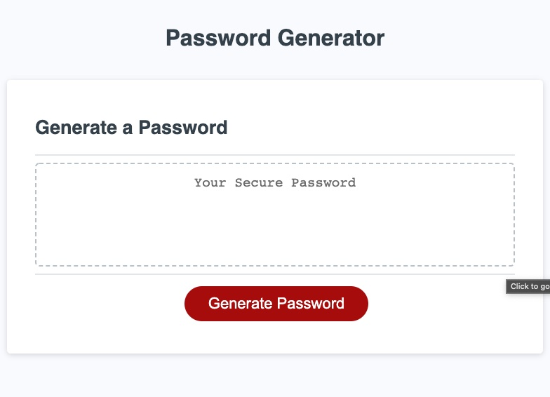

# Password Generator

This password generator creates a randomized password based on input from the user. Criteria for the random password includes length, inclusion of lowercase letters, uppercase letters, numbers, and special characters. 

Languages used:
* Javascript
* HTML
* CSS
